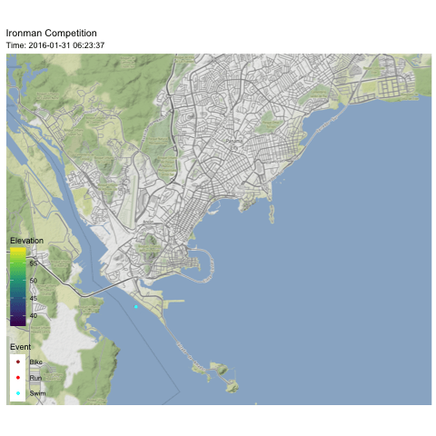

```r
library(tidyverse)     # for data cleaning and plotting
library(gardenR)       # for Lisa's garden data
library(babynames)
library(lubridate)     # for date manipulation
library(openintro)     # for the abbr2state() function
library(palmerpenguins)# for Palmer penguin data
library(maps)          # for map data
library(ggmap)         # for mapping points on maps
library(gplots)        # for col2hex() function
library(RColorBrewer)  # for color palettes
library(sf)            # for working with spatial data
library(leaflet)       # for highly customizable mapping
library(ggthemes)      # for more themes (including theme_map())
library(plotly)        # for the ggplotly() - basic interactivity
library(gganimate)     # for adding animation layers to ggplots
library(transformr)    # for "tweening" (gganimate)
library(gifski)        # need the library for creating gifs but don't need to load each time
library(shiny)         # for creating interactive apps
library(ggnewscale)
library(rsconnect)
theme_set(theme_minimal())
```


```r
# SNCF Train data
small_trains <- read_csv("https://raw.githubusercontent.com/rfordatascience/tidytuesday/master/data/2019/2019-02-26/small_trains.csv") 

#Data
data("garden_harvest")
data("babynames")

# Lisa's Mallorca cycling data
mallorca_bike_day7 <- read_csv("https://www.dropbox.com/s/zc6jan4ltmjtvy0/mallorca_bike_day7.csv?dl=1") %>% 
  select(1:4, speed)

# Heather Lendway's Ironman 70.3 Pan Am championships Panama data
panama_swim <- read_csv("https://raw.githubusercontent.com/llendway/gps-data/master/data/panama_swim_20160131.csv")

panama_bike <- read_csv("https://raw.githubusercontent.com/llendway/gps-data/master/data/panama_bike_20160131.csv")

panama_run <- read_csv("https://raw.githubusercontent.com/llendway/gps-data/master/data/panama_run_20160131.csv")

#COVID-19 data from the New York Times
covid19 <- read_csv("https://raw.githubusercontent.com/nytimes/covid-19-data/master/us-states.csv")
```


## Put your homework on GitHub!

Go [here](https://github.com/llendway/github_for_collaboration/blob/master/github_for_collaboration.md) or to previous homework to remind yourself how to get set up. 

Once your repository is created, you should always open your **project** rather than just opening an .Rmd file. You can do that by either clicking on the .Rproj file in your repository folder on your computer. Or, by going to the upper right hand corner in R Studio and clicking the arrow next to where it says Project: (None). You should see your project come up in that list if you've used it recently. You could also go to File --> Open Project and navigate to your .Rproj file. 

## Instructions

* Put your name at the top of the document. 

* **For ALL graphs, you should include appropriate labels and alt text.** 

* Feel free to change the default theme, which I currently have set to `theme_minimal()`. 

* Use good coding practice. Read the short sections on good code with [pipes](https://style.tidyverse.org/pipes.html) and [ggplot2](https://style.tidyverse.org/ggplot2.html). **This is part of your grade!**

* **NEW!!** With animated graphs, add `eval=FALSE` to the code chunk that creates the animation and saves it using `anim_save()`. Add another code chunk to reread the gif back into the file. See the [tutorial](https://animation-and-interactivity-in-r.netlify.app/) for help. 

* When you are finished with ALL the exercises, uncomment the options at the top so your document looks nicer. Don't do it before then, or else you might miss some important warnings and messages.

## Warm-up exercises from tutorial

  1. Choose 2 graphs you have created for ANY assignment in this class and add interactivity using the `ggplotly()` function.
  

```r
plotly_graph1 <- garden_harvest %>%
  filter(vegetable %in% c("beets")) %>%
  group_by(variety, date) %>%
  mutate(wt_lbs = weight*0.00220462) %>%
  summarize(daily_wt_lbs = sum(wt_lbs)) %>% 
  mutate(cum_wt_lbs = cumsum(daily_wt_lbs)) %>% 
  ggplot() +
  geom_line(aes(x = date,
                y = cum_wt_lbs,
                color = variety,
                text = variety)) + 
  labs(title = "Cumulative Beet Harvest 2020",
       x = "Date",
       y = "Weight (lbs)",
       color = "Variety") + 
  scale_color_manual(values=c("darkgoldenrod2","chartreuse4",
                              "deeppink4"))

ggplotly(plotly_graph1,
         tooltip = c("text", "x"))
```

```{=html}
<div id="htmlwidget-fca6503155accc3c75ed" style="width:672px;height:480px;" class="plotly html-widget"></div>
<script type="application/json" data-for="htmlwidget-fca6503155accc3c75ed">{"x":{"data":[{"x":[18450,18451,18463,18470,18487],"y":[0.13668644,0.3196699,0.55556424,0.88405262,7.0217147],"text":["date: 2020-07-07<br />Gourmet Golden","date: 2020-07-08<br />Gourmet Golden","date: 2020-07-20<br />Gourmet Golden","date: 2020-07-27<br />Gourmet Golden","date: 2020-08-13<br />Gourmet Golden"],"type":"scatter","mode":"lines","line":{"width":1.88976377952756,"color":"rgba(238,173,14,1)","dash":"solid"},"hoveron":"points","name":"Gourmet Golden","legendgroup":"Gourmet Golden","showlegend":true,"xaxis":"x","yaxis":"y","hoverinfo":"text","frame":null},{"x":[18424,18431,18432,18434],"y":[0.01763696,0.07275246,0.09700328,0.22266662],"text":["date: 2020-06-11<br />leaves","date: 2020-06-18<br />leaves","date: 2020-06-19<br />leaves","date: 2020-06-21<br />leaves"],"type":"scatter","mode":"lines","line":{"width":1.88976377952756,"color":"rgba(69,139,0,1)","dash":"solid"},"hoveron":"points","name":"leaves","legendgroup":"leaves","showlegend":true,"xaxis":"x","yaxis":"y","hoverinfo":"text","frame":null},{"x":[18450,18452,18455,18461,18470,18473,18487],"y":[0.0220462,0.17416498,0.37037616,0.7495708,0.85759718,1.0802638,6.38678414],"text":["date: 2020-07-07<br />Sweet Merlin","date: 2020-07-09<br />Sweet Merlin","date: 2020-07-12<br />Sweet Merlin","date: 2020-07-18<br />Sweet Merlin","date: 2020-07-27<br />Sweet Merlin","date: 2020-07-30<br />Sweet Merlin","date: 2020-08-13<br />Sweet Merlin"],"type":"scatter","mode":"lines","line":{"width":1.88976377952756,"color":"rgba(139,10,80,1)","dash":"solid"},"hoveron":"points","name":"Sweet Merlin","legendgroup":"Sweet Merlin","showlegend":true,"xaxis":"x","yaxis":"y","hoverinfo":"text","frame":null}],"layout":{"margin":{"t":43.7625570776256,"r":7.30593607305936,"b":40.1826484018265,"l":31.4155251141553},"font":{"color":"rgba(0,0,0,1)","family":"","size":14.6118721461187},"title":{"text":"Cumulative Beet Harvest 2020","font":{"color":"rgba(0,0,0,1)","family":"","size":17.5342465753425},"x":0,"xref":"paper"},"xaxis":{"domain":[0,1],"automargin":true,"type":"linear","autorange":false,"range":[18420.85,18490.15],"tickmode":"array","ticktext":["Jun 15","Jul 01","Jul 15","Aug 01","Aug 15"],"tickvals":[18428,18444,18458,18475,18489],"categoryorder":"array","categoryarray":["Jun 15","Jul 01","Jul 15","Aug 01","Aug 15"],"nticks":null,"ticks":"","tickcolor":null,"ticklen":3.65296803652968,"tickwidth":0,"showticklabels":true,"tickfont":{"color":"rgba(77,77,77,1)","family":"","size":11.689497716895},"tickangle":-0,"showline":false,"linecolor":null,"linewidth":0,"showgrid":true,"gridcolor":"rgba(235,235,235,1)","gridwidth":0.66417600664176,"zeroline":false,"anchor":"y","title":{"text":"Date","font":{"color":"rgba(0,0,0,1)","family":"","size":14.6118721461187}},"hoverformat":".2f"},"yaxis":{"domain":[0,1],"automargin":true,"type":"linear","autorange":false,"range":[-0.332566927,7.371918587],"tickmode":"array","ticktext":["0","2","4","6"],"tickvals":[0,2,4,6],"categoryorder":"array","categoryarray":["0","2","4","6"],"nticks":null,"ticks":"","tickcolor":null,"ticklen":3.65296803652968,"tickwidth":0,"showticklabels":true,"tickfont":{"color":"rgba(77,77,77,1)","family":"","size":11.689497716895},"tickangle":-0,"showline":false,"linecolor":null,"linewidth":0,"showgrid":true,"gridcolor":"rgba(235,235,235,1)","gridwidth":0.66417600664176,"zeroline":false,"anchor":"x","title":{"text":"Weight (lbs)","font":{"color":"rgba(0,0,0,1)","family":"","size":14.6118721461187}},"hoverformat":".2f"},"shapes":[{"type":"rect","fillcolor":null,"line":{"color":null,"width":0,"linetype":[]},"yref":"paper","xref":"paper","x0":0,"x1":1,"y0":0,"y1":1}],"showlegend":true,"legend":{"bgcolor":null,"bordercolor":null,"borderwidth":0,"font":{"color":"rgba(0,0,0,1)","family":"","size":11.689497716895},"title":{"text":"Variety","font":{"color":"rgba(0,0,0,1)","family":"","size":14.6118721461187}}},"hovermode":"closest","barmode":"relative"},"config":{"doubleClick":"reset","modeBarButtonsToAdd":["hoverclosest","hovercompare"],"showSendToCloud":false},"source":"A","attrs":{"b4214a5f4fab":{"x":{},"y":{},"colour":{},"text":{},"type":"scatter"}},"cur_data":"b4214a5f4fab","visdat":{"b4214a5f4fab":["function (y) ","x"]},"highlight":{"on":"plotly_click","persistent":false,"dynamic":false,"selectize":false,"opacityDim":0.2,"selected":{"opacity":1},"debounce":0},"shinyEvents":["plotly_hover","plotly_click","plotly_selected","plotly_relayout","plotly_brushed","plotly_brushing","plotly_clickannotation","plotly_doubleclick","plotly_deselect","plotly_afterplot","plotly_sunburstclick"],"base_url":"https://plot.ly"},"evals":[],"jsHooks":[]}</script>
```


```r
plotly_graph2 <- babynames%>%
 mutate(has2000 = ifelse(n > 2000, TRUE, FALSE)) %>%
 group_by(year, sex) %>%
  summarise(has2000_prop = sum(has2000, na.rm = TRUE)/n()) %>%
  mutate(has2000_prop = has2000_prop) %>%
  ggplot(aes(x = year, 
             y = has2000_prop, 
             color = sex,
             text = sex)) +
  geom_line() +
  labs(title = "Proportion of Names with Over 2000 Babies",
       x = "Year",
       y = "Proportion of Names",
       color = "Sex")

ggplotly(plotly_graph2,
         tooltip = c("text", "x"))
```

```{=html}
<div id="htmlwidget-57136396cbd2e8e65683" style="width:672px;height:480px;" class="plotly html-widget"></div>
<script type="application/json" data-for="htmlwidget-57136396cbd2e8e65683">{"x":{"data":[{"x":[1880,1881,1882,1883,1884,1885,1886,1887,1888,1889,1890,1891,1892,1893,1894,1895,1896,1897,1898,1899,1900,1901,1902,1903,1904,1905,1906,1907,1908,1909,1910,1911,1912,1913,1914,1915,1916,1917,1918,1919,1920,1921,1922,1923,1924,1925,1926,1927,1928,1929,1930,1931,1932,1933,1934,1935,1936,1937,1938,1939,1940,1941,1942,1943,1944,1945,1946,1947,1948,1949,1950,1951,1952,1953,1954,1955,1956,1957,1958,1959,1960,1961,1962,1963,1964,1965,1966,1967,1968,1969,1970,1971,1972,1973,1974,1975,1976,1977,1978,1979,1980,1981,1982,1983,1984,1985,1986,1987,1988,1989,1990,1991,1992,1993,1994,1995,1996,1997,1998,1999,2000,2001,2002,2003,2004,2005,2006,2007,2008,2009,2010,2011,2012,2013,2014,2015,2016,2017],"y":[0.00318471337579618,0.00319829424307036,0.00486381322957198,0.0047438330170778,0.00511945392491468,0.0050125313283208,0.0062402496099844,0.00535987748851455,0.0101763907734057,0.0101419878296146,0.0110821382007823,0.0110893672537508,0.0132450331125828,0.0139225181598063,0.0135135135135135,0.0138274336283186,0.0142465753424658,0.0138966092273485,0.0156962025316456,0.0141150922909881,0.0179856115107914,0.013381369016984,0.0146914789422135,0.0134421507441191,0.0138568129330254,0.0147717099373321,0.0157657657657658,0.0154230929553981,0.0160230073952342,0.0160910518053375,0.0175627240143369,0.0174337517433752,0.0194484760522496,0.0194227137847316,0.0209224916785544,0.0203342057580028,0.0207283998450213,0.0210843373493976,0.0214822771213749,0.0215866162978953,0.021856027753686,0.0221427354794754,0.0222836413888409,0.0230005227391532,0.0233937955585692,0.0232195460058915,0.0234833659491194,0.0228449045154382,0.0224429727740986,0.0233175355450237,0.0232469512195122,0.0237090616837452,0.023921568627451,0.0236722931247427,0.0229237884576714,0.0237121831561733,0.0238879736408567,0.023949665110615,0.0244293151782139,0.0248384491114701,0.0250746268656716,0.0251720747295969,0.024907063197026,0.025521609538003,0.0247855100095329,0.0236596069452395,0.0237425255012311,0.0239226609864001,0.023841059602649,0.0240725474031327,0.0242186221567665,0.0249557237159878,0.0251916757940854,0.0252346514848438,0.0261487303506651,0.0258736059479554,0.0258533042846768,0.025812892184826,0.025918541726004,0.0252918287937743,0.0257809302960033,0.0251029353167751,0.0243966767770012,0.0246639697246509,0.023836985774702,0.0233638656577725,0.0221901260504202,0.0211491909797426,0.0198926043446424,0.0186035829122646,0.0176470588235294,0.0162896866569828,0.0148017803540006,0.0143804181540031,0.0137708760621154,0.0129135639551324,0.0127522935779817,0.0127163546450018,0.0118570183086312,0.0116152753405198,0.0118450275561405,0.0115706548498277,0.0120061653281415,0.0119353501864898,0.0119957275490921,0.01176,0.0110738516727755,0.0104111655978876,0.0103048209267133,0.0100371236078647,0.00984574991795208,0.00970308558121483,0.0098648388956505,0.00974868645945433,0.0100945971684337,0.0100933155589412,0.00987980617959851,0.00965346534653465,0.0095192191830341,0.00938551443244201,0.00940350082139013,0.00895937673900946,0.0089043747580333,0.0090613130765057,0.00897694677573569,0.00870607861536857,0.0086783042394015,0.00851167315175097,0.00811458180573887,0.00778036572674563,0.00767250517389329,0.00792433537832311,0.00810339522002257,0.00831990016119807,0.00849799280538032,0.00838838209080424,0.00818408885582186,0.00797422032880004],"text":["year: 1880<br />F","year: 1881<br />F","year: 1882<br />F","year: 1883<br />F","year: 1884<br />F","year: 1885<br />F","year: 1886<br />F","year: 1887<br />F","year: 1888<br />F","year: 1889<br />F","year: 1890<br />F","year: 1891<br />F","year: 1892<br />F","year: 1893<br />F","year: 1894<br />F","year: 1895<br />F","year: 1896<br />F","year: 1897<br />F","year: 1898<br />F","year: 1899<br />F","year: 1900<br />F","year: 1901<br />F","year: 1902<br />F","year: 1903<br />F","year: 1904<br />F","year: 1905<br />F","year: 1906<br />F","year: 1907<br />F","year: 1908<br />F","year: 1909<br />F","year: 1910<br />F","year: 1911<br />F","year: 1912<br />F","year: 1913<br />F","year: 1914<br />F","year: 1915<br />F","year: 1916<br />F","year: 1917<br />F","year: 1918<br />F","year: 1919<br />F","year: 1920<br />F","year: 1921<br />F","year: 1922<br />F","year: 1923<br />F","year: 1924<br />F","year: 1925<br />F","year: 1926<br />F","year: 1927<br />F","year: 1928<br />F","year: 1929<br />F","year: 1930<br />F","year: 1931<br />F","year: 1932<br />F","year: 1933<br />F","year: 1934<br />F","year: 1935<br />F","year: 1936<br />F","year: 1937<br />F","year: 1938<br />F","year: 1939<br />F","year: 1940<br />F","year: 1941<br />F","year: 1942<br />F","year: 1943<br />F","year: 1944<br />F","year: 1945<br />F","year: 1946<br />F","year: 1947<br />F","year: 1948<br />F","year: 1949<br />F","year: 1950<br />F","year: 1951<br />F","year: 1952<br />F","year: 1953<br />F","year: 1954<br />F","year: 1955<br />F","year: 1956<br />F","year: 1957<br />F","year: 1958<br />F","year: 1959<br />F","year: 1960<br />F","year: 1961<br />F","year: 1962<br />F","year: 1963<br />F","year: 1964<br />F","year: 1965<br />F","year: 1966<br />F","year: 1967<br />F","year: 1968<br />F","year: 1969<br />F","year: 1970<br />F","year: 1971<br />F","year: 1972<br />F","year: 1973<br />F","year: 1974<br />F","year: 1975<br />F","year: 1976<br />F","year: 1977<br />F","year: 1978<br />F","year: 1979<br />F","year: 1980<br />F","year: 1981<br />F","year: 1982<br />F","year: 1983<br />F","year: 1984<br />F","year: 1985<br />F","year: 1986<br />F","year: 1987<br />F","year: 1988<br />F","year: 1989<br />F","year: 1990<br />F","year: 1991<br />F","year: 1992<br />F","year: 1993<br />F","year: 1994<br />F","year: 1995<br />F","year: 1996<br />F","year: 1997<br />F","year: 1998<br />F","year: 1999<br />F","year: 2000<br />F","year: 2001<br />F","year: 2002<br />F","year: 2003<br />F","year: 2004<br />F","year: 2005<br />F","year: 2006<br />F","year: 2007<br />F","year: 2008<br />F","year: 2009<br />F","year: 2010<br />F","year: 2011<br />F","year: 2012<br />F","year: 2013<br />F","year: 2014<br />F","year: 2015<br />F","year: 2016<br />F","year: 2017<br />F"],"type":"scatter","mode":"lines","line":{"width":1.88976377952756,"color":"rgba(248,118,109,1)","dash":"solid"},"hoveron":"points","name":"F","legendgroup":"F","showlegend":true,"xaxis":"x","yaxis":"y","hoverinfo":"text","frame":null},{"x":[1880,1881,1882,1883,1884,1885,1886,1887,1888,1889,1890,1891,1892,1893,1894,1895,1896,1897,1898,1899,1900,1901,1902,1903,1904,1905,1906,1907,1908,1909,1910,1911,1912,1913,1914,1915,1916,1917,1918,1919,1920,1921,1922,1923,1924,1925,1926,1927,1928,1929,1930,1931,1932,1933,1934,1935,1936,1937,1938,1939,1940,1941,1942,1943,1944,1945,1946,1947,1948,1949,1950,1951,1952,1953,1954,1955,1956,1957,1958,1959,1960,1961,1962,1963,1964,1965,1966,1967,1968,1969,1970,1971,1972,1973,1974,1975,1976,1977,1978,1979,1980,1981,1982,1983,1984,1985,1986,1987,1988,1989,1990,1991,1992,1993,1994,1995,1996,1997,1998,1999,2000,2001,2002,2003,2004,2005,2006,2007,2008,2009,2010,2011,2012,2013,2014,2015,2016,2017],"y":[0.0113421550094518,0.0120361083249749,0.010919017288444,0.0116504854368932,0.0106666666666667,0.0109389243391067,0.0108108108108108,0.0112464854732896,0.0110450297366185,0.0108010801080108,0.0103359173126615,0.00887311446317657,0.0103174603174603,0.0110262934690416,0.0104923325262308,0.0104754230459307,0.0102685624012638,0.00732302685109845,0.0100853374709077,0.00666666666666667,0.00929614873837981,0.00661157024793388,0.00833333333333333,0.00689127105666156,0.00788530465949821,0.00774102744546094,0.00778485491861288,0.00774693350548741,0.00757575757575758,0.00774270399047052,0.00815660685154975,0.0100050025012506,0.0147969717825189,0.0147194112235511,0.0159616919393456,0.0184510250569476,0.0183061314512572,0.0184702303346371,0.01849158528984,0.0180873180873181,0.0180360721442886,0.0180505415162455,0.0185222468290719,0.0185562805872757,0.0191146881287726,0.0193137456338607,0.0196402728964234,0.0199875078076202,0.0205334462320068,0.0206911732335461,0.0211407179035455,0.0210648148148148,0.0224089635854342,0.0223880597014925,0.0230568100784407,0.0231604342581423,0.0232846172900669,0.0243841751679522,0.0250247770069376,0.024955886059995,0.0261686991869919,0.02675,0.0289245982694685,0.028960396039604,0.0289076490150934,0.0296061326989162,0.0313510823587957,0.0328022492970947,0.032864967849488,0.0321199143468951,0.0319732760677643,0.0315219948247471,0.0338266384778013,0.0329569025120996,0.0333180147058824,0.0335004557885141,0.0352808988764045,0.0349297012302285,0.035341186930429,0.034769298053794,0.0359477124183007,0.0350386930352537,0.0346095608911962,0.0346395323663131,0.0350533420422382,0.034841628959276,0.0315255731922399,0.0312087912087912,0.0301624129930394,0.0297619047619048,0.0283609576427256,0.0259946949602122,0.0231304347826087,0.0219537100068074,0.0218151540383014,0.0203630623520126,0.020181790171006,0.0194132243468107,0.0192336144400059,0.0190920661858294,0.0189352360043908,0.0188031841888553,0.0191472026072787,0.0182611065685473,0.0185488270594654,0.0187310381216198,0.0175057500638896,0.0171821305841924,0.0167314716625427,0.0163650157147502,0.0162378743146352,0.0164835164835165,0.0161980440097799,0.0156357557281935,0.0156188988676298,0.0159775346179917,0.0159513862514242,0.015539728054759,0.0147774533227148,0.0150745111551383,0.0151039947177286,0.0150418733230344,0.0149815734657907,0.0147416294205285,0.0145234493192133,0.0144417838970368,0.0138255416191562,0.0138290479499653,0.0134811469239718,0.0131515527094953,0.0128367003367003,0.0131771595900439,0.0132078122804552,0.01410457330104,0.0143091051470065,0.0143325727324586,0.0141222991102952,0.0138418079096045],"text":["year: 1880<br />M","year: 1881<br />M","year: 1882<br />M","year: 1883<br />M","year: 1884<br />M","year: 1885<br />M","year: 1886<br />M","year: 1887<br />M","year: 1888<br />M","year: 1889<br />M","year: 1890<br />M","year: 1891<br />M","year: 1892<br />M","year: 1893<br />M","year: 1894<br />M","year: 1895<br />M","year: 1896<br />M","year: 1897<br />M","year: 1898<br />M","year: 1899<br />M","year: 1900<br />M","year: 1901<br />M","year: 1902<br />M","year: 1903<br />M","year: 1904<br />M","year: 1905<br />M","year: 1906<br />M","year: 1907<br />M","year: 1908<br />M","year: 1909<br />M","year: 1910<br />M","year: 1911<br />M","year: 1912<br />M","year: 1913<br />M","year: 1914<br />M","year: 1915<br />M","year: 1916<br />M","year: 1917<br />M","year: 1918<br />M","year: 1919<br />M","year: 1920<br />M","year: 1921<br />M","year: 1922<br />M","year: 1923<br />M","year: 1924<br />M","year: 1925<br />M","year: 1926<br />M","year: 1927<br />M","year: 1928<br />M","year: 1929<br />M","year: 1930<br />M","year: 1931<br />M","year: 1932<br />M","year: 1933<br />M","year: 1934<br />M","year: 1935<br />M","year: 1936<br />M","year: 1937<br />M","year: 1938<br />M","year: 1939<br />M","year: 1940<br />M","year: 1941<br />M","year: 1942<br />M","year: 1943<br />M","year: 1944<br />M","year: 1945<br />M","year: 1946<br />M","year: 1947<br />M","year: 1948<br />M","year: 1949<br />M","year: 1950<br />M","year: 1951<br />M","year: 1952<br />M","year: 1953<br />M","year: 1954<br />M","year: 1955<br />M","year: 1956<br />M","year: 1957<br />M","year: 1958<br />M","year: 1959<br />M","year: 1960<br />M","year: 1961<br />M","year: 1962<br />M","year: 1963<br />M","year: 1964<br />M","year: 1965<br />M","year: 1966<br />M","year: 1967<br />M","year: 1968<br />M","year: 1969<br />M","year: 1970<br />M","year: 1971<br />M","year: 1972<br />M","year: 1973<br />M","year: 1974<br />M","year: 1975<br />M","year: 1976<br />M","year: 1977<br />M","year: 1978<br />M","year: 1979<br />M","year: 1980<br />M","year: 1981<br />M","year: 1982<br />M","year: 1983<br />M","year: 1984<br />M","year: 1985<br />M","year: 1986<br />M","year: 1987<br />M","year: 1988<br />M","year: 1989<br />M","year: 1990<br />M","year: 1991<br />M","year: 1992<br />M","year: 1993<br />M","year: 1994<br />M","year: 1995<br />M","year: 1996<br />M","year: 1997<br />M","year: 1998<br />M","year: 1999<br />M","year: 2000<br />M","year: 2001<br />M","year: 2002<br />M","year: 2003<br />M","year: 2004<br />M","year: 2005<br />M","year: 2006<br />M","year: 2007<br />M","year: 2008<br />M","year: 2009<br />M","year: 2010<br />M","year: 2011<br />M","year: 2012<br />M","year: 2013<br />M","year: 2014<br />M","year: 2015<br />M","year: 2016<br />M","year: 2017<br />M"],"type":"scatter","mode":"lines","line":{"width":1.88976377952756,"color":"rgba(0,191,196,1)","dash":"solid"},"hoveron":"points","name":"M","legendgroup":"M","showlegend":true,"xaxis":"x","yaxis":"y","hoverinfo":"text","frame":null}],"layout":{"margin":{"t":43.7625570776256,"r":7.30593607305936,"b":40.1826484018265,"l":48.9497716894977},"font":{"color":"rgba(0,0,0,1)","family":"","size":14.6118721461187},"title":{"text":"Proportion of Names with Over 2000 Babies","font":{"color":"rgba(0,0,0,1)","family":"","size":17.5342465753425},"x":0,"xref":"paper"},"xaxis":{"domain":[0,1],"automargin":true,"type":"linear","autorange":false,"range":[1873.15,2023.85],"tickmode":"array","ticktext":["1880","1920","1960","2000"],"tickvals":[1880,1920,1960,2000],"categoryorder":"array","categoryarray":["1880","1920","1960","2000"],"nticks":null,"ticks":"","tickcolor":null,"ticklen":3.65296803652968,"tickwidth":0,"showticklabels":true,"tickfont":{"color":"rgba(77,77,77,1)","family":"","size":11.689497716895},"tickangle":-0,"showline":false,"linecolor":null,"linewidth":0,"showgrid":true,"gridcolor":"rgba(235,235,235,1)","gridwidth":0.66417600664176,"zeroline":false,"anchor":"y","title":{"text":"Year","font":{"color":"rgba(0,0,0,1)","family":"","size":14.6118721461187}},"hoverformat":".2f"},"yaxis":{"domain":[0,1],"automargin":true,"type":"linear","autorange":false,"range":[0.00154656342367095,0.0375858623704259],"tickmode":"array","ticktext":["0.01","0.02","0.03"],"tickvals":[0.01,0.02,0.03],"categoryorder":"array","categoryarray":["0.01","0.02","0.03"],"nticks":null,"ticks":"","tickcolor":null,"ticklen":3.65296803652968,"tickwidth":0,"showticklabels":true,"tickfont":{"color":"rgba(77,77,77,1)","family":"","size":11.689497716895},"tickangle":-0,"showline":false,"linecolor":null,"linewidth":0,"showgrid":true,"gridcolor":"rgba(235,235,235,1)","gridwidth":0.66417600664176,"zeroline":false,"anchor":"x","title":{"text":"Proportion of Names","font":{"color":"rgba(0,0,0,1)","family":"","size":14.6118721461187}},"hoverformat":".2f"},"shapes":[{"type":"rect","fillcolor":null,"line":{"color":null,"width":0,"linetype":[]},"yref":"paper","xref":"paper","x0":0,"x1":1,"y0":0,"y1":1}],"showlegend":true,"legend":{"bgcolor":null,"bordercolor":null,"borderwidth":0,"font":{"color":"rgba(0,0,0,1)","family":"","size":11.689497716895},"title":{"text":"Sex","font":{"color":"rgba(0,0,0,1)","family":"","size":14.6118721461187}}},"hovermode":"closest","barmode":"relative"},"config":{"doubleClick":"reset","modeBarButtonsToAdd":["hoverclosest","hovercompare"],"showSendToCloud":false},"source":"A","attrs":{"b4215f6277ff":{"x":{},"y":{},"colour":{},"text":{},"type":"scatter"}},"cur_data":"b4215f6277ff","visdat":{"b4215f6277ff":["function (y) ","x"]},"highlight":{"on":"plotly_click","persistent":false,"dynamic":false,"selectize":false,"opacityDim":0.2,"selected":{"opacity":1},"debounce":0},"shinyEvents":["plotly_hover","plotly_click","plotly_selected","plotly_relayout","plotly_brushed","plotly_brushing","plotly_clickannotation","plotly_doubleclick","plotly_deselect","plotly_afterplot","plotly_sunburstclick"],"base_url":"https://plot.ly"},"evals":[],"jsHooks":[]}</script>
```

  
  2. Use animation to tell an interesting story with the `small_trains` dataset that contains data from the SNCF (National Society of French Railways). These are Tidy Tuesday data! Read more about it [here](https://github.com/rfordatascience/tidytuesday/tree/master/data/2019/2019-02-26).
  

```r
small_trains %>%
  filter(departure_station == "PARIS EST") %>%
  group_by(year, month, arrival_station, departure_station) %>%
  mutate(date = zoo::as.yearmon(paste(year, month), "%Y %m"),
         trip = paste(departure_station, arrival_station, sep = "-")) %>%
  mutate(tot_trips = sum(total_num_trips)) %>%
  ungroup() %>%
  ggplot(aes(x = date, 
             y = tot_trips, 
             color = trip)) + 
  geom_line() + 
  labs(title = "Departures from Paris Est Station over Time", 
       subtitle = "Trip: {closest_state}",
       x = "",
       y = "") +
  theme(legend.position = "none") +
  transition_states(trip)

anim_save("PARIS_EST.gif")
```

<!-- -->


## Garden data

  3. In this exercise, you will create a stacked area plot that reveals itself over time (see the `geom_area()` examples [here](https://ggplot2.tidyverse.org/reference/position_stack.html)). You will look at cumulative harvest of tomato varieties over time. I have filtered the data to the tomatoes and find the *daily* harvest in pounds for each variety. The `complete()` function creates a row for all unique `date`/`variety` combinations. If a variety is not harvested on one of the harvest dates in the dataset, it is filled with a value of 0. 
  You should do the following:
  * For each variety, find the cumulative harvest in pounds.  
  * Use the data you just made to create a static cumulative harvest area plot, with the areas filled with different colors for each variety and arranged (HINT: `fct_reorder()`) from most to least harvested weights (most on the bottom).  
  * Add animation to reveal the plot over date. Instead of having a legend, place the variety names directly on the graph (refer back to the tutorial for how to do this).


```r
garden_harvest %>% 
  filter(vegetable == "tomatoes") %>% 
  group_by(date, variety) %>% 
  summarize(daily_harvest_lb = sum(weight)*0.00220462) %>% 
  ungroup() %>% 
  complete(variety, 
           date, 
           fill = list(daily_harvest_lb = 0)) %>%
  group_by(variety) %>%
  mutate(cumharvest = cumsum(daily_harvest_lb)) %>%
  ggplot(aes(x = date, 
             y = cumharvest, 
             fill = fct_reorder(variety, cumharvest, .fun = max, .desc = FALSE))) +
  geom_area() +
  geom_text(aes(label = variety), position = "stack") + 
  theme(legend.position = "none") +
  labs(title = "Cumulative Tomato Harvest by Variety During 2020",
       x = "",
       y = "Cumulative Weight (lbs)") +
  transition_reveal(date)

anim_save("Tomatoes.gif")
```

<!-- -->


## Maps, animation, and movement!

  4. Map Lisa's `mallorca_bike_day7` bike ride using animation! 
  Requirements:
  * Plot on a map using `ggmap`.  
  * Show "current" location with a red point. 
  * Show path up until the current point.  
  * Color the path according to elevation.  
  * Show the time in the subtitle.  
  * CHALLENGE: use the `ggimage` package and `geom_image` to add a bike image instead of a red point. You can use [this](https://raw.githubusercontent.com/llendway/animation_and_interactivity/master/bike.png) image. See [here](https://goodekat.github.io/presentations/2019-isugg-gganimate-spooky/slides.html#35) for an example. 
  * Add something of your own! And comment on if you prefer this to the static map and why or why not.
  

```r
mallorca_map <- get_stamenmap(
    bbox = c(left = 2.28, bottom = 39.41, right = 3.03, top = 39.8), 
    maptype = "terrain",
    zoom = 11
)
ggmap(mallorca_map) +
  geom_path(data = mallorca_bike_day7, 
             aes(x = lon, y = lat, color = ele),
             size = .75) +
  geom_point(data = mallorca_bike_day7, 
             aes(x = lon, y = lat),
             size = 1,
             color = "red") +
  scale_color_viridis_c(option = "magma") +
  theme_map() +
  theme(legend.background = element_blank()) + 
  labs(title = "Mallorca Day 7 Ride",
       subtitle = "Time: {frame_along}",
       x = "",
       y = "",
       color = "Elevation") + 
  transition_reveal(time)

anim_save("BikeRide.gif")
```

<!-- -->


**I like the animation better because it shows the speed at which she travels and any breaks she takes along the way.**

  
  5. In this exercise, you get to meet Lisa's sister, Heather! She is a proud Mac grad, currently works as a Data Scientist where she uses R everyday, and for a few years (while still holding a full-time job) she was a pro triathlete. You are going to map one of her races. The data from each discipline of the Ironman 70.3 Pan Am championships, Panama is in a separate file - `panama_swim`, `panama_bike`, and `panama_run`. Create a similar map to the one you created with my cycling data. You will need to make some small changes: 1. combine the files putting them in swim, bike, run order (HINT: `bind_rows()`), 2. make the leading dot a different color depending on the event (for an extra challenge, make it a different image using `geom_image()!), 3. CHALLENGE (optional): color by speed, which you will need to compute on your own from the data. You can read Heather's race report [here](https://heatherlendway.com/2016/02/10/ironman-70-3-pan-american-championships-panama-race-report/). She is also in the Macalester Athletics [Hall of Fame](https://athletics.macalester.edu/honors/hall-of-fame/heather-lendway/184) and still has records at the pool. 
  

```r
panama_map <- get_stamenmap(
    bbox = c(left = -79.6, bottom = 8.9027, right = -79.45, top = 9.025), 
    maptype = "terrain",
    zoom = 14
)

ironman <- bind_rows(panama_swim, panama_bike, panama_run)

ggmap(panama_map) +
  geom_path(data = ironman, 
             aes(x = lon, y = lat, color = ele),
             size = .75) + 
  scale_color_viridis_c() +
  labs(color = "Elevation") +
  new_scale_color() +
  geom_point(data = ironman, 
             aes(x = lon, y = lat, color = event),
             size = 1) + 
  scale_color_manual(values = c("brown", "red", "cyan")) +
  theme_map() +
  theme(legend.background = element_blank()) + 
  labs(title = "Ironman Competition",
       subtitle = "Time: {frame_along}",
       x = "",
       y = "",
       color = "Event") + 
  transition_reveal(time)

anim_save("IronMan.gif")
```

<!-- -->


## COVID-19 data

  6. In this exercise you will animate a map of the US, showing how cumulative COVID-19 cases per 10,000 residents has changed over time. This is similar to exercises 11 & 12 from the previous exercises, with the added animation! So, in the end, you should have something like the static map you made there, but animated over all the days. The code below gives the population estimates for each state and loads the `states_map` data. Here is a list of details you should include in the plot:
  
  * Put date in the subtitle.   
  * Because there are so many dates, you are going to only do the animation for the the 15th of each month. So, filter only to those dates - there are some lubridate functions that can help you do this.   
  * Use the `animate()` function to make the animation 200 frames instead of the default 100 and to pause for 10 frames on the end frame.   
  * Use `group = date` in `aes()`.   
  * Comment on what you see.  


```r
census_pop_est_2018 <- read_csv("https://www.dropbox.com/s/6txwv3b4ng7pepe/us_census_2018_state_pop_est.csv?dl=1") %>% 
  separate(state, into = c("dot","state"), extra = "merge") %>% 
  select(-dot) %>% 
  mutate(state = str_to_lower(state))

states_map <- map_data("state")

covid19$state <- tolower(covid19$state)

covidgif <- covid19 %>% 
  left_join(census_pop_est_2018,
            by = c("state" = "state")) %>% 
  mutate(covid_per_10000 = (cases/est_pop_2018)*10000,
         day = day(date)) %>%
  filter(day == "15") %>%
  ggplot() +
  geom_map(map = states_map,
           aes(map_id = state,
               fill = covid_per_10000,
               group = date)) +
  expand_limits(x = states_map$long, y = states_map$lat) + 
  theme_map() + 
  labs(title = " Current Cumulative Covid Cases per 10000 People by State",
       subtitle = "Date: {frame_time}",
       fill = "Covid per 10000",
       caption = "Created by Emily Bergin") +
  scale_fill_viridis_c(option = "viridis") +
  theme_map() +
  theme(legend.background = element_blank()) + 
  transition_time(date)
  
animate(covidgif, nframes = 200, end_pause = 10)
anim_save("covid.gif")
```

<!-- -->

**Rhode Island has the most Covid cases per 10000. Texas and California have approximately the same number of Covid cases per 10000. Main and Oregon have fewer cumulative Covid cases per 10000 than most of the rest of the country.**

## Your first `shiny` app (for next week!)

  7. This app will also use the COVID data. Make sure you load that data and all the libraries you need in the `app.R` file you create. You should create a new project for the app, separate from the homework project. Below, you will post a link to the app that you publish on shinyapps.io. You will create an app to compare states' daily number of COVID cases per 100,000 over time. The x-axis will be date. You will have an input box where the user can choose which states to compare (`selectInput()`), a slider where the user can choose the date range, and a submit button to click once the user has chosen all states they're interested in comparing. The graph should display a different line for each state, with labels either on the graph or in a legend. Color can be used if need. 
  
Put the link to your app here: 

[here](https://emily-bergin.shinyapps.io/shinyapp_ex5/)
  
## GitHub link

  8. Below, provide a link to your GitHub repo with this set of Weekly Exercises. 

Main page: [here](https://github.com/ebergin12/Exercise05_Bergin)

md file: [here](https://github.com/ebergin12/Exercise05_Bergin/blob/main/05_exercises_new.md)
